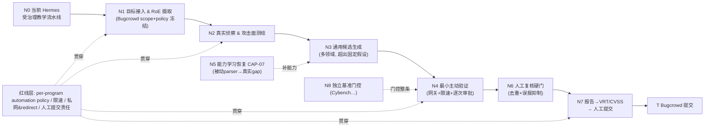

# 报告二：Bugcrowd 场景 · 战争迷雾开发分析说明书

> 方法：沿用 `docs/16` 的「战争迷雾」推理——**钉死两端**（起点=当前 Hermes，终点=Bugcrowd 授权 program 上产出并（人工）提交漏洞报告），把中间迷雾**逐节点点亮**，每个节点判断「当前能否穿过」，并标注可复用的 GitHub 资产（见 `docs/18`）与必须自建的部分。
> **前提红线（不可越）**：仅在**授权 program 的 scope 内**、**遵守其 automation policy 与限速**、**提交动作始终由人完成**。这不是要把 Hermes 变成自治黑客，而是把它的**受治理编排 + 审批/复核硬门 + 学习恢复闭环**延伸到真实授权资产。

---

## 0. 迷雾两端

- **起点 N0**：当前 Hermes = 受策略治理的多 agent 评估控制平面，已在**固定 localhost 教学 fixture** 上三级验证（代码+单测+真实 local-lab E2E），含此前唯一空白的 CAP-07 学习→恢复闭环。**候选是父运行时硬编码**（4 类固定假设 + line_kv_capability_gap），**不做真实发现**，目标输入=localhost。
- **终点 T**：在 Bugcrowd 某 program 上，按其 scope/VRT，对**真实授权资产**做评估，产出**符合平台分类的漏洞报告草稿**，经人工复核后由**人**提交。
- **两端之间**就是要点亮的迷雾。下图是「隧道」：

图例（能否穿过）：🟢 现成/小改可穿　🟡 半程/需实质自建　🔴 完全空白/核心攻坚

---

## 1. 逐节点点亮

### N0 → 起点：当前 Hermes　🟢（已点亮）
- **现状**：GOV-01 scope 冻结、GOV-02 HTTP Gateway/pinned transport、DET-01~04 主链、GOV-03 审批、GOV-05 复核硬门、CAP-07 学习恢复——都在**固定 fixture** 上真实跑通。
- **复用**：这正是 Hermes 相对纯 agent 框架（Strix/PentAGI）的**独特资产**——治理与审计。后续节点的策略是「**能力借外部工具，治理留 Hermes**」。

---

### N1 目标接入 & RoE 摄取　🔴（完全空白，最先攻坚）
- **预期**：从 Bugcrowd program 读取 scope（域名/资产/排除项）、**automation policy**（是否允许自动化扫描、限速）、赏金分级，冻结为 Hermes 的 RoE。
- **当前 Hermes**：只有 localhost `host: localhost` 的手写 scope；`grep` 确认**无 real-asset profile / 目标选择机制**。
- **可复用 GitHub 资产**：Bugcrowd 有 API/Docs（scope、engagement VRT scope rules）；[bugcrowd/VRT](https://github.com/bugcrowd/vulnerability-rating-taxonomy) 提供机器可读分类。
- **需自建**：① Bugcrowd program → Hermes `ScopeProfile` 的摄取器（域/CIDR/scheme/port/排除/私网禁飞）；② **automation-policy 硬门**：program 若禁自动化扫描则 Hermes 拒绝进入主动节点；③ 限速/审计保留策略（对应 `docs/15` §10.5 real-asset profile）。
- **红线**：scope 只能来自**人确认**的 program 授权，不能由网页/模型自行扩大（`docs/08` §4.6）。
- **判据**：给定一个 program，Hermes 能生成一份被人签核的 `ScopeProfile`，且越界目标一律被 Gateway 拒绝。

---

### N2 真实侦察 & 攻击面测绘　🟡（能力现成，接线需自建）
- **预期**：对 scope 内资产发现子域/存活/端点/参数/认证入口/技术栈，形成有 coverage 的结构化清单。
- **当前 Hermes**：DET-01 的测绘只认教学 fixture 的固定 Link；不做真实发现。
- **可复用**：**直接调用** [ProjectDiscovery](https://github.com/projectdiscovery)（subfinder/httpx/katana/naabu）、[nuclei](https://github.com/projectdiscovery/nuclei)、[bbot](https://github.com/blacklanternsecurity/bbot)；经 [pd-tools-mcp](https://github.com/intelligent-ears/pd-tools-mcp) 以 MCP 接入 Gateway。
- **需自建**：adapter：工具 JSON → Hermes `EndpointInventoryV3`（保持证据链 `EvidenceArtifactRef`、scope 校验、限速）。
- **红线**：所有探测走 Hermes Gateway（GOV-02），受 scope + 限速 + program automation policy 约束；被动优先、主动受控。
- **判据**：对一个授权域，产出带证据的 `EndpointInventoryV3`，且所有请求可在审计里回放并证明在 scope 内。

---

### N3 通用候选生成（多领域）　🔴→🟡（核心攻坚，但有现成引擎）
- **预期**：Web/API/Authz/Infra 专家在**真实测绘**上产出带反例与所需证据的候选，覆盖远超当前 4 类固定假设。
- **当前 Hermes**：`build_candidate_blueprints` **父运行时硬编码**候选（注释：不能 be invented by a model）——这是教学期的**安全设计**，但对真实场景是**能力缺口**。
- **可复用**：① [nuclei](https://github.com/projectdiscovery/nuclei) 模板（黑盒，海量 CVE/misconfig/exposure）作为「确定性候选源」；② 参考 [Strix](https://github.com/usestrix/strix) 的多 agent + PoC 范式做「探索性候选源」；③ 白盒目标可参考 [vulnhuntr](https://github.com/protectai/vulnhuntr)（AGPL，隔离调用）。
- **需自建**：把「探索性候选」**收敛回 Hermes 的纪律**——candidate/blocked/inconclusive 分离、不因单模板命中就升级、每个候选带反例与所需证据。即：模型/工具**扩大候选来源**，但 execution-authority 字段仍由父运行时或确定性规则固定。
- **红线**：主包不得含任意利用生成；探索性/利用性能力隔离到 `extensions/`（`docs/07` 不变量 4）。
- **判据**：在一个真实靶标上，Hermes 产出的候选集里，每个候选都能追到证据且带反例；nuclei 命中与 agent 假设都进同一套 candidate 契约。

---

### N4 最小主动验证（网关 + 限速 + 逐次审批）　🟡（Hermes 已有骨架，需真实化）
- **预期**：RoE 允许且逐次审批时，Verifier 用正反对照 + 最小请求证明/否定候选。
- **当前 Hermes**：DET-03 + GovernedGatewayV3 + 逐次审批在 fixture 上跑通；但 GOV-02 的命令输出/凭据 broker「半程」（`docs/16` 节点 B），且无真实限速/并发治理。
- **可复用**：参考 [Strix](https://github.com/usestrix/strix) 「每个候选 PoC 验证」；HTTP 层继续用 Hermes pinned transport。
- **需自建**：① 真实**限速/退避/并发上限**（贴 program policy）；② 凭据 broker 闭环（授权测试凭据的受控注入）；③ 主动验证的「读多写少、禁破坏性」硬约束。
- **红线**：**逐次审批 + 正反对照**不可省；禁 DoS/破坏性/爆破；变更类动作走 mutation 审批 + 补偿。
- **判据**：真实靶标上，一个候选经审批后被最小请求证明/否定，全过程限速合规、可审计、可回滚。

---

### N5 能力学习恢复 CAP-07（被动 parser → 真实 gap）　🟡（闭环已通，需扩域）
- **预期**：遇到不能解析/不会处理的 gap（新协议/编码/资产类型），识别→研究可信资料→能力规格→生成候选 Wheel→离线+沙箱验证→人工签名→受控复用→效果反馈/撤销。
- **当前 Hermes**：CAP-07 已**真实端到端闭环**，但只在 `line_kv` 被动 parser 上验证（`docs/15` §11.11）。
- **可复用**：[vulnhuntr](https://github.com/protectai/vulnhuntr) 的「LLM 追调用链」可作某类 gap 的 Wheel 参考；研究节点可接检索。
- **需自建**：把 Wheel 从「零请求被动 parser」扩到更多**受治理**能力类型（仍限：离线/沙箱/无网/签名审批/可撤销）。
- **红线**：Wheel 生成/复用不得改 scope/审批/策略；沙箱无网、非 root、digest-pin（已实现）。
- **判据**：一个真实 gap（如某编码响应）→ 学得 Wheel → 沙箱验证 → 签名 → 在后续评估中被复用解 gap，全链审计闭合。

---

### N6 人工复核硬门 + 去重 + 误报抑制　🟡（Hermes 有硬门，需抗真实噪声）
- **预期**：candidate/blocked/inconclusive 与 ValidatedFinding 分离；报告前从 canonical artifacts 逐项重验；对真实世界的**海量误报/重复**做抑制。
- **当前 Hermes**：GOV-05 复核 + DET-04 报告硬门 + 语义去重在 fixture 上跑通；但未面对真实 nuclei/agent 的噪声量级。
- **可复用**：[bugcrowd/VRT](https://github.com/bugcrowd/vulnerability-rating-taxonomy) 的分类可辅助「重复/已知」判定。
- **需自建**：① 真实去重（跨资产/跨模板）；② 误报抑制与置信度门；③「已知/重复/超出 scope」过滤（避免刷量垃圾报告）。
- **红线**：只有经硬门重验的 ValidatedFinding 能进报告；**不得把 candidate 当 finding**。
- **判据**：一批真实候选经复核后，进入报告的 finding 误报率/重复率低于设定门，且每条都可从 canonical 工件逐项重放。

---

### N7 报告生成 → VRT/CVSS → 人工提交　🟡（报告有骨架，平台映射与提交需自建）
- **预期**：把 ValidatedFinding 生成**符合 Bugcrowd 分类**的报告草稿（标题/复现步骤/影响/PoC/VRT 分级/CVSS），交人复核后**由人提交**。
- **当前 Hermes**：reporting_v3/v4 能生成结构化报告，但无 Bugcrowd VRT/提交格式。
- **可复用**：[bugcrowd/VRT](https://github.com/bugcrowd/vulnerability-rating-taxonomy)（机器可读，映射 CVSS，P1–P5）；Bugcrowd Docs 的 submission 规范。
- **需自建**：① ValidatedFinding → VRT 类别 + CVSS 向量映射；② Bugcrowd 报告模板（复现步骤/影响/PoC）；③ **提交前人工签核**工作流（草稿→人审→人提交）。
- **红线**：**提交动作永远由人执行**；禁自动批量提交（平台「beg bounty」/刷量会封号，也违背 Hermes 治理）；报告内容不得夸大/编造。
- **判据**：一条真实 finding 产出可被人直接采用的 Bugcrowd 草稿，VRT/CVSS 分级合理，人一键复核后手动提交。

---

### N8 独立基准门控（横切，门控整条）　🔴（`docs/15` §10.4 的空白）
- **预期**：在把 Hermes 输出用于真实 program **之前**，用独立基准证明检测率/误报率，形成可信度门。
- **当前 Hermes**：无独立 benchmark（§10.4 未动）。
- **可复用**：**直接调用** [Cybench](https://github.com/andyzorigin/cybench)（子任务细粒度）、[AutoPenBench](https://github.com/lucagioacchini/auto-pen-bench)、[NYU CTF Bench](https://github.com/NYU-LLM-CTF/NYU_CTF_Bench)。
- **需自建**：把 Hermes 接成这些基准的 agent，定期跑，作为「未达门不上真实 program」的**回归门**（接进 CI/self-hosted runner）。
- **判据**：Hermes 在选定基准上有可复现的分数与趋势；低于门时禁用真实 program 主动节点。

---

## 2. 红线层（贯穿所有节点）

| 约束 | 说明 | 落点 |
|---|---|---|
| per-program automation policy | 禁自动化扫描的 program 直接拒绝进入主动节点 | N1 门 → N2/N4 |
| 限速/退避/并发上限 | 贴 program policy，禁 DoS | N2/N4 Gateway |
| 私网/redirect/DNS 策略 | 禁私网、禁危险 redirect | N1 profile → Gateway |
| 逐次审批 + 正反对照 | 主动验证不可省审批 | N4 |
| 利用能力隔离 | 任意利用/爆破/RCE 隔离到 `extensions/` | N3/N4 |
| **人工提交** | 提交动作永远由人执行；禁批量/刷量 | N7 |
| 审计可回放 | 每个请求/裁决可从 canonical 工件重放 | 全链 |

---

## 3. 攻坚顺序与「能否穿过」总览

| 节点 | 能否穿过 | 主要工作 | 依赖 |
|---|---|---|---|
| N0 起点 | 🟢 | 已完成 | — |
| **N1 目标接入&RoE** | 🔴 | Bugcrowd scope+policy 摄取、real-asset profile | 最先做 |
| N2 侦察测绘 | 🟡 | 接 ProjectDiscovery/bbot（MCP）→ InventoryV3 | N1 |
| **N3 通用候选** | 🔴→🟡 | nuclei 模板 + 收敛回 Hermes 候选纪律 | N2 |
| N4 最小验证 | 🟡 | 真实限速/凭据 broker/逐次审批 | N1,N3 |
| N5 学习恢复 | 🟡 | CAP-07 扩域（仍受治理） | N3 可选增强 |
| N6 复核硬门 | 🟡 | 真实去重/误报抑制 | N4 |
| N7 报告→提交 | 🟡 | VRT/CVSS 映射 + 人工提交流 | N6 |
| **N8 基准门控** | 🔴 | Cybench/AutoPenBench 回归门 | 横切，门控 N3/N4 |

**关键判断**：三段「红」是核心攻坚——**N1（目标接入&RoE）**、**N3（通用候选生成）**、**N8（基准门控）**。其中 N1 与 N8 是**治理/可信度**问题（Hermes 的强项，属延伸），N3 是**能力**问题（借外部引擎 + 收敛回纪律）。N2/N4/N5/N6/N7 都是「Hermes 已有骨架 + 接外部工具/映射」的半程，风险可控。

**诚实边界**：即便全部点亮，也需先过 N8 基准证明检测率、且每个 program 遵守其 automation policy、提交由人负责——这是**负责任地**接近 Bugcrowd 的唯一路径，不能靠「扩大主动扫描」抄近路（`docs/15` §2.2）。

---

## 4. 建议的最小起步（下一步设计从这里开）
1. **N1 real-asset profile 契约**：定义 `ScopeProfile`（scope/automation-policy/限速/私网禁飞/审计保留）+ Bugcrowd 摄取器 + 人工签核。这是所有主动能力的**前置硬门**。
2. **N8 基准骨架**：接 Cybench/AutoPenBench 做一次基线跑分，建立「可信度门」，接进现有 CI/self-hosted runner。
3. 之后再做 N2（ProjectDiscovery via MCP → InventoryV3）与 N3（nuclei 候选源收敛）。

> N1 与 N8 都属 Hermes 的治理强项，先做能**同时降低风险并建立可信度基线**，再逐步开放能力节点——与 Hermes「治理先于能力」的一贯设计一致。
